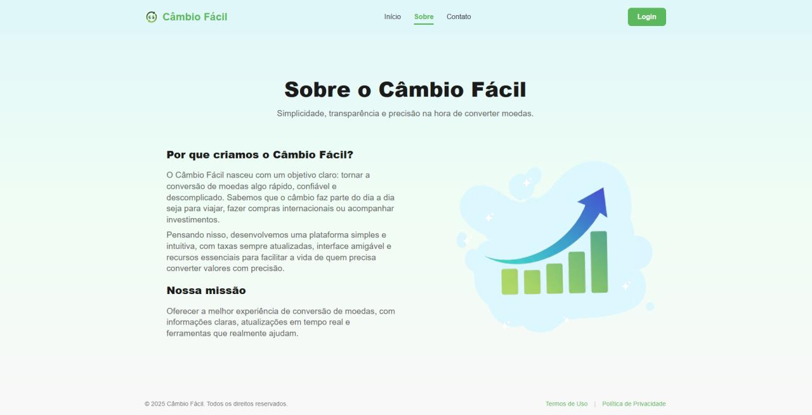
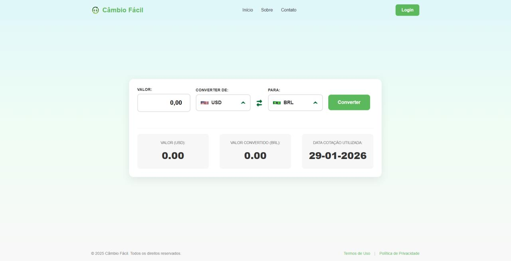

  🌐 <b>Idiomas:</b> 
  <a href="./README.md">English 🇺🇸</a> • 
  <b>Português 🇧🇷</b>

 

# 💱 Câmbio Fácil

Aplicação web desenvolvida em **Python (Flask)** para conversão de moedas em tempo real utilizando uma API de câmbio.  
A plataforma permite que o usuário crie sua conta, realize conversões com valores atualizados, acompanhe o histórico de operações e gerencie seu perfil.

 

## 🚀 Funcionalidades

- Cadastro e autenticação de usuários  
- Conversão de moedas em tempo real  
- Registro automático das operações realizadas  
- Consulta ao histórico individual  
- Edição de informações do perfil  

 

## 🛠 Tecnologias

- Python  
- Flask  
- HTML  
- CSS  
- JavaScript  
- API de câmbio  

 

## 💡 Usabilidade

O sistema foi projetado com foco em simplicidade e agilidade.  
A navegação é intuitiva, permitindo que o usuário realize conversões rapidamente e acompanhe suas movimentações sem complexidade.

 

## 📸 Interface da Aplicação
 
<table align="center" border="0" cellspacing="0" cellpadding="0">
  <tr>
    <td align="left"><b>Página Inicial</b></td>
    <td align="left"><b>Sobre</b></td>
    <td align="left"><b>Conversão de Moedas</b></td>
  </tr>
  <tr>
    <td></td>
    <td></td>
    <td></td>
  </tr>
</table>

 

## ▶ Como executar o projeto

1. Clonar o repositório  
2. Instalar dependências  
3. Executar a aplicação
